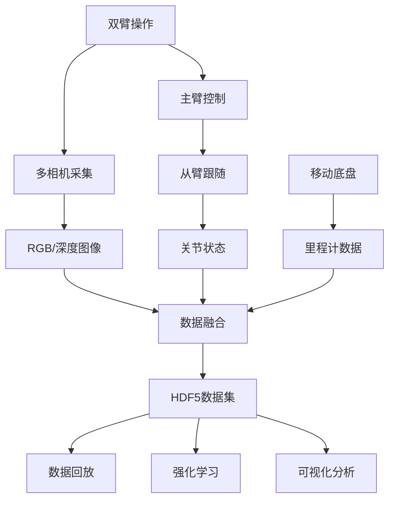
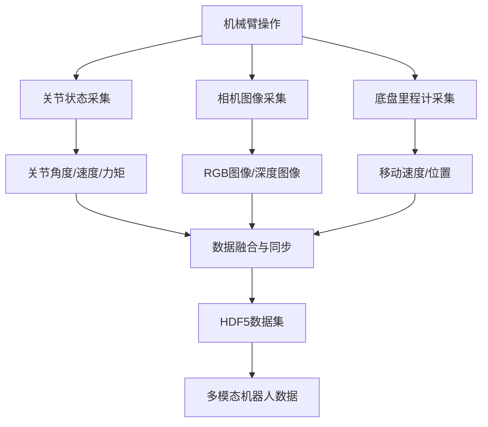
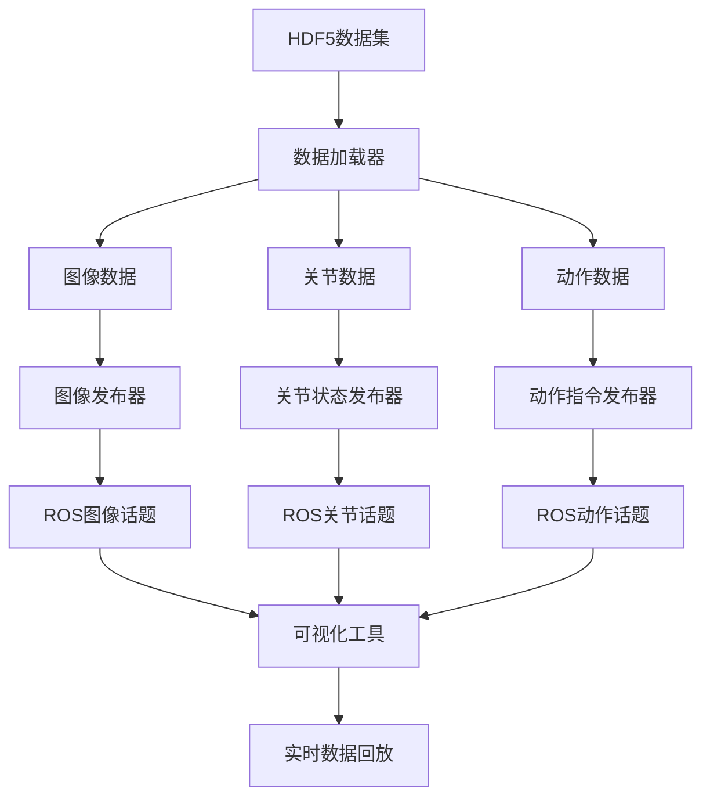
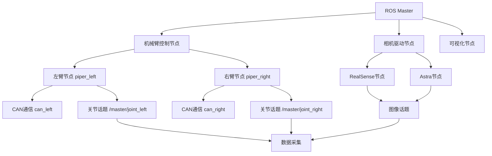

# Cobot Magic - 双臂遥操作机器人系统

[](http://wiki.ros.org/noetic)
[](https://www.python.org/)
[](https://ubuntu.com/)

## 项目简介

Cobot Magic 是一个基于ROS的双臂遥操作机器人系统，专为机器人学习、数据采集和强化学习研究设计。系统集成了双AGX机械臂、多相机传感器和移动平台，支持完整的数据采集-回放-训练流程。

### 核心特性

- 🤖 **双臂遥操作** - 主从式双AGX机械臂控制
- 📹 **多相机系统** - 支持RealSense和Astra相机
- 💾 **多模态数据采集** - RGB图像、深度图像、关节状态、动作数据
- 🔧 **ROS集成** - 完整的ROS节点和launch文件
- 📊 **HDF5数据格式** - 标准化的机器人数据集格式
- 🎯 **强化学习支持** - 集成robomimic框架
- 🚡 **移动平台** - 支持移动底盘的里程计采集

## 系统架构

```
Cobot Magic System
├── 硬件层
│   ├── 双AGX机械臂 (主臂 + 从臂)
│   ├── 多相机系统
│   │   ├── RealSense相机 (RGB-D)
│   │   └── Astra相机 (深度)
│   ├── 移动底盘 (带里程计)
│   └── CAN总线控制器
├── 驱动层
│   ├── Piper ROS驱动
│   ├── 相机ROS驱动
│   └── CAN通信模块
├── 中间件层
│   ├── ROS Noetic
│   ├── 话题通信
│   └── Launch文件管理
├── 应用层
│   ├── 数据采集模块
│   ├── 数据回放模块
│   ├── 可视化工具
│   └── 强化学习接口
└── 数据层
    ├── HDF5数据集
    ├── 图像数据流
    └── 机器人状态数据
```

### 主要组件

| 组件 | 功能 | 位置 |
|------|------|------|
| **数据采集** | 多模态数据采集与保存 | `/collect_data/` |
| **机械臂控制** | AGX双臂控制与状态读取 | `/Piper_ros_private-ros-noetic/` |
| **相机驱动** | RealSense/Astra相机集成 | `/camera_ws/` |
| **强化学习** | robomimic学习框架 | `/aloha-devel/` |
| **工具脚本** | CAN配置和系统工具 | `/tools/` |

## 数据流程



## 目录结构

```
cobot_magic/
├── collect_data/              # 数据采集和回放模块
│   ├── collect_data.py       # 主数据采集脚本
│   ├── replay_data.py        # 数据回放脚本
│   ├── visualize_episodes.py # 数据可视化工具
│   └── piper_sdk_demo/       # Piper SDK示例
├── camera_ws/                # 相机ROS工作空间
│   ├── src/realsense-ros/    # RealSense相机驱动
│   └── src/ros_astra_camera/ # Astra相机驱动
├── Piper_ros_private-ros-noetic/ # AGX机械臂ROS驱动
│   ├── src/piper/            # 机械臂控制节点
│   └── src/piper_description/ # 机械臂描述文件
├── aloha-devel/              # 强化学习框架
│   └── act/                  # DETR检测模型
└── tools/                    # 系统工具脚本
    ├── can_activate.sh       # CAN设备激活
    └── can_config.sh         # CAN设备配置
```

## 快速概览

### 环境要求
- Ubuntu 20.04
- ROS Noetic
- Python 3.8+
- 兼容的CAN总线设备

### 主要功能
- **数据采集**: `python collect_data.py --dataset_dir ~/data`
- **数据回放**: `python replay_data.py --dataset_dir ~/data --episode_idx 0`
- **机械臂控制**: `roslaunch piper start_ms_piper.launch`
- **可视化**: `python visualize_episodes.py --dataset_dir ~/data`

开始使用请参考 [环境配置](#环境配置) 章节。

---

## 环境配置

### 系统要求

- **操作系统**: Ubuntu 20.04 LTS
- **ROS版本**: ROS Noetic
- **Python版本**: Python 3.8+
- **硬件**: 兼容的USB转CAN设备
- **存储**: 建议至少50GB可用空间（用于数据存储）

### 1. ROS Noetic 安装

如果尚未安装ROS Noetic，请按以下步骤安装：

```bash
# 添加ROS软件源
sudo sh -c 'echo "deb http://packages.ros.org/ros/ubuntu $(lsb_release -cs) main" > /etc/apt/sources.list.d/ros-latest.list'

# 添加密钥
sudo apt-key adv --keyserver 'hkp://keyserver.ubuntu.com:80' --recv-key C1CF6E31E6BADE8868B172B4F42ED6FBAB17C654

# 更新软件包列表
sudo apt update

# 安装ROS Noetic完整版
sudo apt install ros-noetic-desktop-full

# 初始化rosdep
sudo rosdep init
rosdep update

# 配置环境
echo "source /opt/ros/noetic/setup.bash" >> ~/.bashrc
source ~/.bashrc
```

### 2. Python依赖安装

```bash
# 安装系统Python包
sudo apt install python3-pip python3-dev python3-venv

# 创建虚拟环境（推荐）
python3 -m venv ~/cobot_env
source ~/cobot_env/bin/activate

# 升级pip
pip install --upgrade pip

# 安装项目依赖
pip install opencv-python==4.9.0.80 \
            matplotlib==3.7.5 \
            h5py==3.8.0 \
            dm-env==1.6 \
            numpy==1.23.4 \
            pyyaml \
            rospkg==1.5.0 \
            catkin-pkg==1.0.0 \
            empy==3.3.4 \
            python-can
```

#### 2.1 使用本地 LeRobot 源码（无需 fork）

如果你已经把 `lerobot-0.4.3` 解压到当前工作区（与 `cobot_magic` 同级目录），可直接切换到本地可编辑源码：

```bash
# 在虚拟环境中执行
source ~/cobot_env/bin/activate

# 1) 安装本地 editable 版本（改源码立即生效）
bash cobot_magic/tools/install_local_lerobot.sh

# 2) 可选：仅当前 shell 强制本地源码优先
source cobot_magic/tools/use_local_lerobot.sh

# 3) 验证导入位置
python -c "import lerobot, pathlib; print(pathlib.Path(lerobot.__file__).resolve())"
```

> `install_local_lerobot.sh` 会卸载已安装的 PyPI 版 `lerobot`，并使用本地目录做 `pip install -e`。  
> `use_local_lerobot.sh` 通过 `PYTHONPATH` 让当前 shell 优先加载本地 `src/lerobot`。

### 3. CAN总线配置

系统使用CAN总线与AGX机械臂通信。配置步骤如下：

#### 3.1 安装CAN工具

```bash
# 安装CAN工具
sudo apt install can-utils

# 启用CAN内核模块
sudo modprobe can
sudo modprobe can_raw
```

#### 3.2 单机械臂配置

如果您只有一个USB转CAN模块：

```bash
# 进入项目目录
cd /home/agilex/cobot_magic/Piper_ros_private-ros-noetic/src/piper

# 直接激活CAN设备
bash can_activate.sh can0 1000000

# 验证设备激活
ifconfig can0
```

#### 3.3 双机械臂配置

对于双机械臂系统（两个USB转CAN模块）：

```bash
# 编辑配置文件
cd /home/agilex/cobot_magic/Piper_ros_private-ros-noetic/src/piper

# 1. 查看第一个CAN设备的bus-info
sudo ethtool -i can0 | grep bus
# 记录输出，例如: 1-2:1.0

# 2. 查看第二个CAN设备的bus-info
sudo ethtool -i can1 | grep bus
# 记录输出，例如: 1-4:1.0

# 3. 编辑can_config.sh文件，将记录的bus-info更新到配置中
# 例如：
# USB_PORTS["1-2:1.0"]="can_left:1000000"
# USB_PORTS["1-4:1.0"]="can_right:1000000"

# 4. 执行配置脚本
bash can_config.sh

# 5. 验证设备激活
ifconfig can_left
ifconfig can_right
```

#### 3.4 CAN设备命名约定

- `can_left`: 左侧机械臂CAN设备
- `can_right`: 右侧机械臂CAN设备
- `can0`, `can1`: 默认CAN设备名称
- 波特率: `1000000` (1Mbps)

### 4. 编译ROS工作空间

```bash
# 编译相机工作空间
cd /home/agilex/cobot_magic/camera_ws
catkin_make
source devel/setup.bash

# 编译机械臂工作空间
cd /home/agilex/cobot_magic/Piper_ros_private-ros-noetic
catkin_make
source devel/setup.bash

# 添加到bashrc（可选）
echo "source /home/agilex/cobot_magic/camera_ws/devel/setup.bash" >> ~/.bashrc
echo "source /home/agilex/cobot_magic/Piper_ros_private-ros-noetic/devel/setup.bash" >> ~/.bashrc
```

### 5. 设备权限配置

确保用户有权限访问USB设备：

```bash
# 添加用户到dialout组
sudo usermod -a -G dialout $USER

# 创建udev规则（可选）
sudo sh -c 'echo "SUBSYSTEM==\"usb\", MODE=\"0666\"" > /etc/udev/rules.d/99-usb-permissions.rules'

# 重新加载udev规则
sudo udevadm control --reload-rules
sudo udevadm trigger

# 注销并重新登录以使组权限生效
```

### 6. Piper SDK安装

```bash
# 安装Piper SDK（如果不在requirements中）
pip install piper_sdk

# 验证安装
python -c "import piper_sdk; print('Piper SDK installed successfully')"
```

### 7. 环境验证

完成以上步骤后，验证环境配置：

```bash
# 1. 检查ROS环境
printenv | grep ROS

# 2. 检查CAN设备
ifconfig | grep can

# 3. 检查Python包
python -c "import cv2, h5py, rospy; print('Python dependencies OK')"

# 4. 检查Piper SDK
python -c "import piper_sdk; print('Piper SDK OK')"
```

### 常见配置问题

#### 问题1: CAN设备无法激活
```bash
# 解决方案：重新加载CAN模块
sudo rmmod can
sudo rmmod can_raw
sudo modprobe can
sudo modprobe can_raw
```

#### 问题2: ROS工作空间未找到
```bash
# 解决方案：手动source工作空间
source /opt/ros/noetic/setup.bash
source /home/agilex/cobot_magic/camera_ws/devel/setup.bash
source /home/agilex/cobot_magic/Piper_ros_private-ros-noetic/devel/setup.bash
```

#### 问题3: USB设备权限不足
```bash
# 解决方案：临时使用sudo运行
sudo bash can_activate.sh can0 1000000

# 永久解决方案：添加用户到dialout组并重新登录
sudo usermod -a -G dialout $USER
```

## 快速开始

### 硬件连接

#### 双机械臂连接图

```
[主臂] ←--- CAN总线 ---→ [从臂]
   ↑                      ↑
   |                      |
[CAN模块1]              [CAN模块2]
   ↓                      ↓
[USB端口1]              [USB端口2]
                          ↓
                     [控制电脑]
```

#### 连接步骤

1. **机械臂配置**
   - 将一个AGX机械臂设置为主臂模式
   - 将另一个AGX机械臂设置为从臂模式
   - 两个机械臂都断电

2. **CAN总线连接**
   - 将两个机械臂通过CAN线连接到同一个CAN总线
   - 连接主臂和从臂的CAN端口

3. **USB连接**
   - 将CAN总线控制器连接到电脑USB端口
   - 确认CAN设备被系统识别

4. **上电顺序**
   - 先给从臂上电
   - 再给主臂上电
   - 等待几秒钟让系统稳定

### 系统启动流程

#### 1. 启动ROS Core

```bash
# 在新终端中启动ROS Master
roscore
```

#### 2. 激活CAN设备

```bash
# 进入机械臂驱动目录
cd /home/agilex/cobot_magic/Piper_ros_private-ros-noetic/src/piper

# 激活双CAN设备
bash can_config.sh

# 验证设备状态
ifconfig can_left can_right
```

#### 3. 启动机械臂节点

```bash
# 启动双机械臂节点（用于数据采集）
roslaunch piper start_ms_piper.launch mode:=0 auto_enable:=true

# 如果需要直接控制从臂
# roslaunch piper start_ms_piper.launch mode:=1 auto_enable:=true
```

#### 4. 验证节点状态

```bash
# 查看活动的ROS节点
rosnode list

# 查看ROS话题
rostopic list

# 查看机械臂关节状态
rostopic echo /master/joint_left
rostopic echo /puppet/joint_left
```

### 基本操作验证

#### 1. 机械臂状态检查

```bash
# 查看机械臂状态
rostopic echo /arm_status

# 检查关节角度
rostopic echo /master/joint_left
rostopic echo /master/joint_right
```

#### 2. 手动遥操作测试

- **主臂操作**: 移动主臂，从臂应该同步跟随
- **关节检查**: 通过话题监控关节角度变化
- **状态反馈**: 确认arm_status显示正常的连接状态

#### 3. 系统完整性检查

```bash
# 检查所有必要的话题是否存在
rostopic list | grep -E "(master|puppet|arm_status)"

# 检查节点是否正常运行
rosnode list | grep piper

# 检查话题发布频率
rostopic hz /master/joint_left
```

### 启动成功标志

当系统正常启动时，您应该看到：

1. **CAN设备**: `ifconfig`显示`can_left`和`can_right`设备
2. **ROS节点**: `rosnode list`显示两个piper节点
3. **话题活跃**: `rostopic hz`显示关节状态话题正常发布数据
4. **机械臂响应**: 主臂移动时从臂同步跟随
5. **状态正常**: `/arm_status`话题显示连接正常

### 故障排除

#### 问题1: 机械臂不响应

```bash
# 检查CAN连接
ifconfig can_left
ifconfig can_right

# 检查机械臂使能状态
rostopic echo /arm_status

# 重新使能机械臂（如果需要）
rostopic pub /enable_flag std_msgs/Bool "data: true"
```

#### 问题2: 从臂不跟随主臂

```bash
# 检查mode参数
rosparam get /piper_left/mode
rosparam get /piper_right/mode

# 确保mode=0（读取模式）
rosparam set /piper_left/mode 0
rosparam set /piper_right/mode 0
```

#### 问题3: ROS节点无法启动

```bash
# 重新source环境
source /opt/ros/noetic/setup.bash
source /home/agilex/cobot_magic/Piper_ros_private-ros-noetic/devel/setup.bash

# 检查设备权限
ls -l /dev/ttyUSB*
```

### 下一步

系统启动成功后，您可以：

- [数据采集](#数据采集) - 开始采集机器人操作数据
- [数据回放](#数据回放) - 回放和分析已采集的数据
- [ROS节点管理](#ros节点管理) - 了解更多节点配置选项

## 数据采集

数据采集模块负责收集机器人操作过程中的多模态数据，包括图像、关节状态、动作信息等，并将其保存为标准化的HDF5格式数据集。

### 数据采集架构



### 数据格式

采集的数据以HDF5格式存储，结构如下：

```
dataset.hdf5
├── observations/
│   ├── images/
│   │   ├── cam_high/         # 前方相机RGB图像 [N, 480, 640, 3]
│   │   ├── cam_left_wrist/   # 左腕相机RGB图像 [N, 480, 640, 3]
│   │   └── cam_right_wrist/  # 右腕相机RGB图像 [N, 480, 640, 3]
│   ├── images_depth/         # 深度图像 (可选) [N, 480, 640]
│   │   ├── cam_high/
│   │   ├── cam_left_wrist/
│   │   └── cam_right_wrist/
│   ├── qpos/                 # 关节位置 [N, 14]
│   ├── qvel/                 # 关节速度 [N, 14]
│   └── effort/               # 关节力矩 [N, 14]
├── action/                   # 动作指令 [N, 14]
└── base_action/              # 底盘动作 [N, 2]
```

### 采集参数配置

#### 必需参数

```bash
--dataset_dir     # 数据保存目录
--episode_idx     # 数据集索引号
```

#### 可选参数

```bash
--task_name               # 任务名称 (默认: aloha_mobile_dummy)
--max_timesteps           # 最大时间步数 (默认: 500)
--camera_names            # 相机名称列表 (默认: ['cam_high', 'cam_left_wrist', 'cam_right_wrist'])
--use_depth_image         # 是否采集深度图像 (默认: False)
--move_distance           # 移动距离限制 (默认: 1.0)
--show_fps                # 显示采集帧率 (默认: True)
--dt                      # 采集时间间隔 (默认: 0.033)
```

### 基本数据采集

#### 1. 启动数据采集

```bash
# 进入数据采集目录
cd /home/agilex/cobot_magic/collect_data

# 基本数据采集
python collect_data.py --dataset_dir ~/datasets --episode_idx 0

# 自定义参数采集
python collect_data.py \
    --dataset_dir ~/datasets \
    --episode_idx 0 \
    --task_name "pick_and_place" \
    --max_timesteps 1000 \
    --camera_names "['cam_high', 'cam_left_wrist', 'cam_right_wrist']"
```

#### 2. 包含深度图像的采集

```bash
# 启用深度图像采集
python collect_data.py \
    --dataset_dir ~/datasets \
    --episode_idx 0 \
    --use_depth_image True
```

#### 3. 高帧率采集

```bash
# 设置更短的时间间隔以获得更高帧率
python collect_data.py \
    --dataset_dir ~/datasets \
    --episode_idx 0 \
    --dt 0.025  # 40Hz
```

### 相机配置

系统支持多种相机配置：

#### 标准三相机配置

```python
camera_names = ['cam_high', 'cam_left_wrist', 'cam_right_wrist']

# 对应的ROS话题:
# /cam_high/color/image_raw
# /cam_left_wrist/color/image_raw
# /cam_right_wrist/color/image_raw
```

#### 自定义相机配置

```bash
# 使用自定义相机配置
python collect_data.py \
    --dataset_dir ~/datasets \
    --episode_idx 0 \
    --camera_names "['custom_cam1', 'custom_cam2']"
```

### 机器人数据采集

#### 关节数据

- **qpos**: 14维关节位置 (双臂各7关节)
- **qvel**: 14维关节速度
- **effort**: 14维关节力矩

#### 动作数据

- **action**: 14维控制动作指令
- **base_action**: 2维底盘速度指令

#### 里程计数据

- **base_vel**: 移动底盘速度信息
- **base_vel_t265**: T265相机里程计 (可选)

### 高级采集配置

#### 1. 批量数据采集脚本

创建批量采集脚本：

```bash
#!/bin/bash
# batch_collect.sh

DATASET_DIR="~/datasets"
TASK_NAME="pick_and_place"
MAX_TIMESTEPS=2000

for episode in {0..9}; do
    echo "采集第 $episode 组数据..."
    python collect_data.py \
        --dataset_dir $DATASET_DIR \
        --episode_idx $episode \
        --task_name $TASK_NAME \
        --max_timesteps $MAX_TIMESTEPS \
        --use_depth_image True

    echo "第 $episode 组数据采集完成"
    sleep 2  # 间隔2秒
done

echo "批量数据采集完成"
```

#### 2. 实时监控采集过程

```python
# monitor_collection.py
import h5py
import time

def monitor_dataset(dataset_path):
    while True:
        try:
            with h5py.File(dataset_path, 'r') as f:
                qpos_len = len(f['/observations/qpos'])
                action_len = len(f['/action'])
                print(f"已采集 {qpos_len} 步数据, {action_len} 个动作")
            time.sleep(5)
        except:
            break

# 使用: python -c "import monitor_collection; monitor_collection.collect_data('dataset.hdf5')"
```

### 数据质量检查

#### 1. 数据完整性验证

```bash
# 检查数据集大小
python -c "
import h5py
with h5py.File('dataset.hdf5', 'r') as f:
    print('数据集大小:')
    for key in f.keys():
        print(f'  {key}: {f[key].shape}')
"
```

#### 2. 图像数据质量检查

```bash
# 检查图像数据
python -c "
import h5py
import cv2
import numpy as np

with h5py.File('dataset.hdf5', 'r') as f:
    # 检查第一帧图像
    img = f['/observations/images/cam_high'][0]
    print(f'图像尺寸: {img.shape}')
    print(f'图像数据类型: {img.dtype}')
    print(f'像素值范围: [{img.min()}, {img.max()}]')
"
```

### 采集最佳实践

#### 1. 硬件准备

- 确保所有相机已正确校准
- 验证机械臂主从关系正常
- 检查存储空间充足

#### 2. 环境设置

- 选择光照稳定的环境
- 避免相机镜头遮挡
- 确保操作空间充足

#### 3. 操作技巧

- 操作过程中保持动作流畅
- 避免剧烈运动导致图像模糊
- 确保任务完整性

#### 4. 数据管理

- 定期检查采集数据质量
- 及时清理无效数据
- 建立数据标注系统

### 常见问题

#### 问题1: 图像采集卡顿

```bash
# 降低采集分辨率或帧率
python collect_data.py --dt 0.05  # 20Hz

# 或者减少相机数量
python collect_data.py --camera_names "['cam_high']"
```

#### 问题2: 数据保存失败

```bash
# 检查存储空间和权限
df -h
ls -la ~/datasets/

# 确保目录存在且有写权限
mkdir -p ~/datasets
chmod 755 ~/datasets
```

#### 问题3: 关节数据异常

```bash
# 检查机械臂节点状态
rostopic echo /master/joint_left
rostopic hz /master/joint_left

# 确保机械臂已正确使能
rostopic pub /enable_flag std_msgs/Bool "data: true"
```

### 下一步

数据采集完成后，您可以：

- [数据回放](#数据回放) - 回放和分析采集的数据
- [数据可视化](#数据可视化) - 可视化分析数据内容
- [强化学习训练](#强化学习训练) - 使用数据进行模型训练

## 数据回放

数据回放模块允许您重新播放采集的机器人数据，进行数据验证、可视化分析和算法测试。

### 回放架构



### 回放功能特性

- **多模态数据回放** - 同步回放图像、关节、动作数据
- **可调节速度** - 支持加速/减速回放
- **数据插值** - 平滑运动轨迹
- **选择性回放** - 可只回放部分数据类型
- **ROS话题发布** - 与其他ROS节点无缝集成

### 基本数据回放

#### 1. 标准回放

```bash
# 进入数据采集目录
cd /home/agilex/cobot_magic/collect_data

# 基本回放
python replay_data.py --dataset_dir ~/datasets --episode_idx 0 --task_name aloha_mobile_dummy

# 指定回放速度
python replay_data.py --dataset_dir ~/datasets --episode_idx 0 --task_name aloha_mobile_dummy --dt 0.05
```

#### 2. 高级回放选项

```bash
# 带插值的平滑回放
python replay_data.py \
    --dataset_dir ~/datasets \
    --episode_idx 0 \
    --task_name "pick_and_place" \
    --enable_interpolation True \
    --interpolation_steps 5

# 只回放主臂数据
python replay_data.py \
    --dataset_dir ~/datasets \
    --episode_idx 0 \
    --replay_mode "master_only"
```

### 回放参数配置

#### 必需参数

```bash
--dataset_dir     # 数据集目录
--episode_idx     # 数据集索引号
--task_name       # 任务名称
```

#### 可选参数

```bash
--dt                      # 回放时间间隔 (默认: 0.033)
--enable_interpolation    # 启用数据插值 (默认: False)
--interpolation_steps     # 插值步数 (默认: 5)
--replay_mode            # 回放模式 (默认: "full")
--camera_names           # 相机名称列表
--publish_images         # 是否发布图像 (默认: True)
--publish_joints         # 是否发布关节数据 (默认: True)
--publish_actions        # 是否发布动作 (默认: True)
```

### 回放模式

#### 1. 完整回放模式

```bash
# 回放所有数据类型
python replay_data.py --replay_mode "full" --dataset_dir ~/datasets --episode_idx 0

# 发布的ROS话题:
# /cam_high/color/image_raw
# /cam_left_wrist/color/image_raw
# /cam_right_wrist/color/image_raw
# /joint_states
# /base_action
```

#### 2. 主臂回放模式

```bash
# 只回放主臂数据
python replay_data.py --replay_mode "master_only" --dataset_dir ~/datasets --episode_idx 0

# 发布的ROS话题:
# /master/joint_left
# /master/joint_right
```

#### 3. 关节回放模式

```bash
# 只回放关节数据，不发布图像
python replay_data.py \
    --replay_mode "joints_only" \
    --publish_images False \
    --dataset_dir ~/datasets \
    --episode_idx 0
```

### 数据可视化回放

#### 1. 实时图像查看

```bash
# 启动图像查看节点
rosrun image_view image_view image:=/cam_high/color/image_raw

# 或使用rqt_image_view
rqt_image_view /cam_high/color/image_raw
```

#### 2. RViz可视化

```bash
# 启动RViz进行机器人状态可视化
roslaunch piper start_single_piper_rviz.launch

# 在新终端中启动回放
python replay_data.py --dataset_dir ~/datasets --episode_idx 0
```

#### 3. 关节轨迹查看

```bash
# 查看关节轨迹
rostopic echo /joint_states

# 查看关节发布频率
rostopic hz /joint_states
```

### 批量数据回放

#### 1. 多数据集回放脚本

```bash
#!/bin/bash
# batch_replay.sh

DATASET_DIR="~/datasets"
TASK_NAME="pick_and_place"

for episode in {0..4}; do
    echo "回放第 $episode 组数据..."

    python replay_data.py \
        --dataset_dir $DATASET_DIR \
        --episode_idx $episode \
        --task_name $TASK_NAME \
        --dt 0.05

    echo "第 $episode 组数据回放完成"
    sleep 1
done

echo "批量数据回放完成"
```

#### 2. 自动验证脚本

```python
#!/usr/bin/env python3
# validate_datasets.py

import h5py
import numpy as np
import os

def validate_dataset(dataset_path):
    """验证数据集完整性"""
    try:
        with h5py.File(dataset_path, 'r') as f:
            required_keys = [
                '/observations/qpos',
                '/observations/qvel',
                '/action',
                '/base_action'
            ]

            # 检查必需的数据键
            for key in required_keys:
                if key not in f:
                    print(f"❌ 缺少数据键: {key}")
                    return False

            # 检查图像数据
            if '/observations/images' in f:
                for cam_name in f['/observations/images'].keys():
                    cam_data = f[f'/observations/images/{cam_name}']
                    print(f"✅ 相机 {cam_name}: {cam_data.shape}")

            # 检查数据一致性
            qpos_len = len(f['/observations/qpos'])
            action_len = len(f['/action'])

            if qpos_len != action_len:
                print(f"❌ 数据长度不一致: qpos={qpos_len}, action={action_len}")
                return False

            print(f"✅ 数据集验证通过: {qpos_len} 时间步")
            return True

    except Exception as e:
        print(f"❌ 数据集验证失败: {e}")
        return False

if __name__ == "__main__":
    dataset_dir = input("请输入数据集目录: ")

    for filename in os.listdir(dataset_dir):
        if filename.endswith('.hdf5'):
            dataset_path = os.path.join(dataset_dir, filename)
            print(f"\n验证 {filename}...")
            validate_dataset(dataset_path)
```

### 数据分析工具

#### 1. 统计分析

```python
#!/usr/bin/env python3
# analyze_dataset.py

import h5py
import numpy as np
import matplotlib.pyplot as plt

def analyze_dataset(dataset_path):
    """分析数据集统计信息"""
    with h5py.File(dataset_path, 'r') as f:
        print("=== 数据集统计信息 ===")

        # 关节数据分析
        qpos = f['/observations/qpos'][:]
        action = f['/action'][:]

        print(f"总时间步数: {len(qpos)}")
        print(f"关节数据形状: {qpos.shape}")
        print(f"动作数据形状: {action.shape}")

        # 关节角度范围
        print(f"\n关节角度范围:")
        for i in range(7):  # 左臂7个关节
            joint_name = f"left_joint_{i+1}"
            angles = qpos[:, i]
            print(f"  {joint_name}: [{angles.min():.3f}, {angles.max():.3f}] rad")

        for i in range(7, 14):  # 右臂7个关节
            joint_name = f"right_joint_{i-6}"
            angles = qpos[:, i]
            print(f"  {joint_name}: [{angles.min():.3f}, {angles.max():.3f}] rad")

        # 动作统计
        print(f"\n动作统计:")
        print(f"  动作均值: {np.mean(np.abs(action)):.3f}")
        print(f"  动作最大值: {np.max(np.abs(action)):.3f}")

        # 图像数据统计
        if '/observations/images' in f:
            print(f"\n图像数据:")
            for cam_name in f['/observations/images'].keys():
                img_data = f[f'/observations/images/{cam_name}']
                print(f"  {cam_name}: {img_data.shape}, {img_data.dtype}")

if __name__ == "__main__":
    dataset_path = input("请输入数据集路径: ")
    analyze_dataset(dataset_path)
```

#### 2. 关节轨迹可视化

```python
#!/usr/bin/env python3
# visualize_trajectory.py

import h5py
import matplotlib.pyplot as plt
import numpy as np

def visualize_joints(dataset_path, save_path=None):
    """可视化关节轨迹"""
    with h5py.File(dataset_path, 'r') as f:
        qpos = f['/observations/qpos'][:]
        time_steps = np.arange(len(qpos)) * 0.033  # 假设30Hz

        # 创建子图
        fig, axes = plt.subplots(2, 7, figsize=(20, 8))
        fig.suptitle('Joint Trajectories', fontsize=16)

        # 绘制左臂关节
        for i in range(7):
            axes[0, i].plot(time_steps, qpos[:, i])
            axes[0, i].set_title(f'Left Joint {i+1}')
            axes[0, i].set_xlabel('Time (s)')
            axes[0, i].set_ylabel('Angle (rad)')
            axes[0, i].grid(True)

        # 绘制右臂关节
        for i in range(7):
            axes[1, i].plot(time_steps, qpos[:, i+7])
            axes[1, i].set_title(f'Right Joint {i+1}')
            axes[1, i].set_xlabel('Time (s)')
            axes[1, i].set_ylabel('Angle (rad)')
            axes[1, i].grid(True)

        plt.tight_layout()

        if save_path:
            plt.savefig(save_path, dpi=300, bbox_inches='tight')
            print(f"轨迹图已保存到: {save_path}")
        else:
            plt.show()

if __name__ == "__main__":
    dataset_path = input("请输入数据集路径: ")
    save_path = input("请输入保存路径 (可选): ") or None
    visualize_joints(dataset_path, save_path)
```

### 回放最佳实践

#### 1. 回放前检查

```bash
# 确认数据集存在
ls -la ~/datasets/

# 检查数据集完整性
python validate_datasets.py

# 检查ROS环境
rosnode list
rostopic list
```

#### 2. 性能优化

```bash
# 降低回放频率以减少负载
python replay_data.py --dt 0.1  # 10Hz

# 禁用图像发布以节省资源
python replay_data.py --publish_images False

# 只发布必要的话题
python replay_data.py --camera_names "['cam_high']"
```

#### 3. 调试技巧

```bash
# 检查话题发布情况
rostopic list | grep -E "(cam_|joint|action)"

# 监控话题发布频率
rostopic hz /joint_states
rostopic hz /cam_high/color/image_raw

# 查看话题数据内容
rostopic echo /joint_states -n 5
```

### 常见问题

#### 问题1: 回放速度过快或过慢

```bash
# 调整时间间隔
python replay_data.py --dt 0.05  # 减慢回放速度
python replay_data.py --dt 0.02  # 加快回放速度
```

#### 问题2: 图像话题无法显示

```bash
# 检查图像话题是否发布
rostopic list | grep cam

# 检查图像话题数据
rostopic hz /cam_high/color/image_raw

# 重新启动图像查看器
rqt_image_view /cam_high/color/image_raw
```

#### 问题3: 关节运动不连续

```bash
# 启用插值功能
python replay_data.py --enable_interpolation True --interpolation_steps 5

# 调整插值步数
python replay_data.py --interpolation_steps 10  # 更平滑
```

#### 问题4: 内存占用过高

```bash
# 分段回放大数据集
python replay_data.py --episode_idx 0 --max_timesteps 500

# 禁用某些数据类型
python replay_data.py --publish_images False
```

### 下一步

数据回放后，您可以：

- [数据可视化](#数据可视化) - 深入分析数据特征
- [算法测试](#算法测试) - 在回放数据上测试控制算法
- [数据预处理](#数据预处理) - 为机器学习准备数据
- [ROS节点管理](#ros节点管理) - 了解更多节点配置

## ROS节点管理

ROS节点管理系统提供了对双AGX机械臂、相机和其他外设的完整控制。系统通过多个协同工作的ROS节点实现硬件控制和数据通信。

### 节点架构



### 核心节点类型

#### 1. 机械臂控制节点

| 节点名称 | 功能 | 主要参数 |
|---------|------|----------|
| `piper_start_ms_node.py` | 双机械臂主从控制 | `mode`, `can_port`, `auto_enable` |
| `piper_ctrl_single_node.py` | 单机械臂独立控制 | `can_port`, `rviz_ctrl_flag` |
| `piper_start_ms_node.py` (mode=1) | 从臂直接控制 | `enable_flag`, `master topics` |

#### 2. 相机驱动节点

| 节点 | 相机类型 | 话题 |
|------|----------|------|
| `realsense2_camera` | RealSense D400系列 | `/cam_high/color/image_raw` |
| `astra_camera` | Astra深度相机 | `/cam_*/color/image_raw` |

#### 3. 可视化节点

| 节点 | 功能 | 用途 |
|------|------|------|
| `rviz` | 3D可视化 | 机械臂状态显示 |
| `rqt_image_view` | 图像显示 | 实时图像查看 |
| `rqt_plot` | 数据绘图 | 关节角度监控 |

### Launch文件详解

#### 1. 双机械臂主从控制

```xml
<!-- start_ms_piper.launch -->
<launch>
  <arg name="mode" default="0" />
  <arg name="auto_enable" default="true" />

  <!-- 左侧机械臂节点 -->
  <node name="piper_left" pkg="piper" type="piper_start_ms_node.py">
    <param name="can_port" value="can_left" />
    <param name="mode" value="$(arg mode)" />
    <param name="auto_enable" value="$(arg auto_enable)" />
    <remap from="/puppet/joint_states" to="/puppet/joint_left" />
    <remap from="/master/joint_states" to="/master/joint_left" />
  </node>

  <!-- 右侧机械臂节点 -->
  <node name="piper_right" pkg="piper" type="piper_start_ms_node.py">
    <param name="can_port" value="can_right" />
    <param name="mode" value="$(arg mode)" />
    <param name="auto_enable" value="$(arg auto_enable)" />
    <remap from="/puppet/joint_states" to="/puppet/joint_right" />
    <remap from="/master/joint_states" to="/master/joint_right" />
  </node>
</launch>
```

**使用场景：**
- **数据采集模式**: `mode=0` - 读取主从臂数据，用于数据采集
- **直接控制模式**: `mode=1` - 直接控制从臂，需要断开主臂连接

#### 2. 单机械臂控制

```xml
<!-- start_single_piper.launch -->
<launch>
  <arg name="can_port" default="can0" />
  <arg name="auto_enable" default="true" />
  <arg name="girpper_exist" default="true" />
  <arg name="rviz_ctrl_flag" default="true" />

  <node name="piper_ctrl_single_node" pkg="piper" type="piper_ctrl_single_node.py">
    <param name="can_port" value="$(arg can_port)" />
    <param name="auto_enable" value="$(arg auto_enable)" />
    <param name="girpper_exist" value="$(arg girpper_exist)" />
    <param name="rviz_ctrl_flag" value="$(arg rviz_ctrl_flag)" />
    <remap from="joint_ctrl_single" to="/joint_states" />
  </node>
</launch>
```

#### 3. RViz集成控制

```xml
<!-- start_single_piper_rviz.launch -->
<launch>
  <arg name="can_port" default="can0" />
  <arg name="auto_enable" default="true" />

  <!-- 启动机械臂描述文件显示 -->
  <include file="$(find piper_description)/launch/display_xacro.launch"/>

  <!-- 启动机械臂控制节点 -->
  <node name="piper_ctrl_single_node" pkg="piper" type="piper_ctrl_single_node.py">
    <param name="can_port" value="$(arg can_port)" />
    <param name="auto_enable" value="$(arg auto_enable)" />
    <param name="rviz_ctrl_flag" value="true" />
    <param name="girpper_exist" value="true" />
    <remap from="joint_ctrl_single" to="/joint_states" />
  </node>
</launch>
```

### 节点启动方法

#### 1. 标准启动流程

```bash
# 1. 启动ROS Master
roscore

# 2. 激活CAN设备
cd /home/agilex/cobot_magic/Piper_ros_private-ros-noetic/src/piper
bash can_config.sh

# 3. 启动双机械臂节点（数据采集模式）
roslaunch piper start_ms_piper.launch mode:=0 auto_enable:=true

# 4. 启动相机节点（新终端）
source /home/agilex/cobot_magic/camera_ws/devel/setup.bash
roslaunch realsense2_camera rs_camera.launch camera_type:=d435
```

#### 2. 分步启动调试

```bash
# 分别启动左右机械臂节点进行调试
rosrun piper piper_start_ms_node.py _can_port:=can_left _mode:=0 _auto_enable:=true
rosrun piper piper_start_ms_node.py _can_port:=can_right _mode:=0 _auto_enable:=true
```

#### 3. 相机节点启动

```bash
# RealSense相机
roslaunch realsense2_camera rs_camera.launch \
    camera_type:=d435 \
    camera_name:=cam_high \
    enable_color:=true \
    enable_depth:=true

# 多相机配置
roslaunch realsense2_camera rs_multiple_devices.launch
```

### 节点参数配置

#### 机械臂节点参数

| 参数 | 类型 | 默认值 | 说明 |
|------|------|--------|------|
| `can_port` | string | can0 | CAN设备端口 |
| `mode` | int | 0 | 控制模式 (0=读取, 1=控制) |
| `auto_enable` | bool | true | 自动使能机械臂 |
| `girpper_exist` | bool | true | 是否存在夹爪 |
| `rviz_ctrl_flag` | bool | false | 启用RViz控制 |

#### 相机节点参数

```bash
# RealSense相机参数
roslaunch realsense2_camera rs_camera.launch \
    camera_type:=d435 \
    color_width:=640 \
    color_height:=480 \
    color_fps:=30 \
    depth_width:=640 \
    depth_height:=480 \
    depth_fps:=30 \
    enable_pointcloud:=true
```

### 话题通信

#### 1. 关节状态话题

```bash
# 主臂关节状态
/master/joint_left      # 左主臂关节 [14]
/master/joint_right     # 右主臂关节 [14]

# 从臂关节状态
/puppet/joint_left      # 左从臂关节 [14]
/puppet/joint_right     # 右从臂关节 [14]

# 统一关节状态
/joint_states           # 合并关节数据 [14]
```

#### 2. 图像话题

```bash
# RGB图像
/cam_high/color/image_raw         # 前方相机RGB
/cam_left_wrist/color/image_raw   # 左腕相机RGB
/cam_right_wrist/color/image_raw  # 右腕相机RGB

# 深度图像
/cam_high/depth/image_raw         # 前方相机深度
/cam_left_wrist/depth/image_raw   # 左腕相机深度
/cam_right_wrist/depth/image_raw  # 右腕相机深度
```

#### 3. 控制话题

```bash
# 机械臂使能
/enable_flag                      # 布尔值使能信号

# 底盘控制
/cmd_vel                          # 移动底盘速度指令

# 系统状态
/arm_status                       # 机械臂状态反馈
```

### 节点监控与调试

#### 1. 节点状态检查

```bash
# 查看运行中的节点
rosnode list

# 查看节点信息
rosnode info piper_left

# 检查节点通信
rqt_graph
```

#### 2. 话题监控

```bash
# 查看所有话题
rostopic list

# 监控话题频率
rostopic hz /master/joint_left
rostopic hz /cam_high/color/image_raw

# 查看话题数据
rostopic echo /master/joint_left
rostopic echo /arm_status
```

#### 3. 参数监控

```bash
# 查看参数列表
rosparam list

# 查看特定参数
rosparam get /piper_left/can_port
rosparam get /piper_left/mode

# 动态设置参数
rosparam set /piper_left/mode 1
```

### 高级节点配置

#### 1. 自定义Launch文件

创建自定义启动文件：

```xml
<!-- custom_dual_arm.launch -->
<launch>
  <!-- 参数定义 -->
  <arg name="left_arm_port" default="can_left" />
  <arg name="right_arm_port" default="can_right" />
  <arg name="enable_cameras" default="true" />
  <arg name="enable_rviz" default="false" />

  <!-- 机械臂节点 -->
  <include file="$(find piper)/launch/start_ms_piper.launch">
    <arg name="mode" value="0" />
    <arg name="auto_enable" value="true" />
  </include>

  <!-- 相机节点 (可选) -->
  <group if="$(arg enable_cameras)">
    <include file="$(find realsense2_camera)/launch/rs_camera.launch">
      <arg name="camera_name" value="cam_high" />
    </include>
  </group>

  <!-- RViz (可选) -->
  <group if="$(arg enable_rviz)">
    <include file="$(find piper_description)/launch/display_xacro.launch"/>
  </group>
</launch>
```

#### 2. 节点依赖管理

```xml
<!-- 带依赖检查的启动文件 -->
<launch>
  <!-- 检查CAN设备 -->
  <include file="$(find piper)/launch/check_can_devices.launch" />

  <!-- 机械臂节点依赖CAN设备 -->
  <node pkg="piper" type="piper_start_ms_node.py" name="piper_left"
        respawn="true" respawn_delay="5">
    <param name="can_port" value="can_left" />
    <remap from="/puppet/joint_states" to="/puppet/joint_left" />
  </node>
</launch>
```

### 故障排除

#### 1. 节点启动失败

```bash
# 检查节点依赖
rospack depends1 piper
rospack find piper

# 检查Python路径
echo $PYTHONPATH
which python3

# 检查ROS环境
printenv | grep ROS
```

#### 2. CAN通信问题

```bash
# 检查CAN设备状态
ifconfig | grep can
sudo ip link set can_left up
sudo ip link set can_right up

# 监控CAN通信
candump can_left
candump can_right
```

#### 3. 相机节点问题

```bash
# 检查相机设备
ls /dev/video*
v4l2-ctl --list-devices

# 重启相机驱动
sudo rmmod uvcvideo
sudo modprobe uvcvideo
```

#### 4. 话题通信异常

```bash
# 检查话题发布者
rostopic info /master/joint_left

# 检查网络配置
ifconfig
ping localhost

# 重启ROS Master
killall roscore
roscore
```

### 性能优化

#### 1. 节点资源管理

```bash
# 监控节点资源占用
top -p $(pgrep -f piper)
htop

# 调整节点优先级
renice -10 $(pgrep -f piper)
```

#### 2. 话题频率优化

```bash
# 降低图像发布频率
rosrun dynamic_reconfigure dynparam set /cam_high camera_fps 15

# 减少关节状态发布频率
rosrun topic_tools throttle messages /master/joint_left 10.0
```

#### 3. 内存管理

```bash
# 监控内存使用
free -h
cat /proc/meminfo | grep MemTotal

# 清理ROS缓存
rosnode cleanup
```

### 下一步

ROS节点管理配置完成后，您可以：

- [数据采集](#数据采集) - 开始采集多模态数据
- [系统监控](#系统监控) - 建立完整的监控体系
- [故障排除](#常见问题) - 解决遇到的系统问题

## 常见问题

本章节汇总了用户在使用Cobot Magic系统时可能遇到的常见问题及其解决方案。

### 环境配置问题

#### Q1: ROS Noetic安装后无法找到roslaunch命令

**问题描述：**
```bash
roslaunch: command not found
```

**解决方案：**
```bash
# 重新source ROS环境
source /opt/ros/noetic/setup.bash

# 添加到bashrc永久生效
echo "source /opt/ros/noetic/setup.bash" >> ~/.bashrc
source ~/.bashrc

# 验证安装
which roslaunch
rosversion -d
```

#### Q2: Python依赖安装失败

**问题描述：**
```bash
ERROR: Could not install packages due to an EnvironmentError
```

**解决方案：**
```bash
# 使用虚拟环境
python3 -m venv ~/cobot_env
source ~/cobot_env/bin/activate

# 升级pip
pip install --upgrade pip

# 逐个安装依赖
pip install opencv-python==4.9.0.80
pip install matplotlib==3.7.5
pip install h5py==3.8.0
```

#### Q3: CAN设备权限问题

**问题描述：**
```bash
Error: Permission denied while opening device
```

**解决方案：**
```bash
# 添加用户到dialout组
sudo usermod -a -G dialout $USER

# 重新登录或使用newgrp
newgrp dialout

# 临时解决方案
sudo chmod 666 /dev/ttyUSB*
```

### 硬件连接问题

#### Q4: 机械臂无法连接

**症状：**
- CAN设备显示正常但机械臂无响应
- `/arm_status`话题无数据

**排查步骤：**
```bash
# 1. 检查CAN连接
ifconfig | grep can

# 2. 检查机械臂电源
# 确认机械臂已上电且指示灯正常

# 3. 重新配置CAN设备
cd /home/agilex/cobot_magic/Piper_ros_private-ros-noetic/src/piper
bash can_config.sh

# 4. 检查机械臂ID配置
# 确认主从臂ID设置正确
```

#### Q5: 相机无法启动

**症状：**
- 相机话题不存在
- `rqt_image_view`显示黑屏

**排查步骤：**
```bash
# 1. 检查相机设备
ls /dev/video*
v4l2-ctl --list-devices

# 2. 检查USB权限
ls -la /dev/video*

# 3. 重新插拔USB设备
# 等待系统重新识别

# 4. 检查相机驱动
sudo apt install ros-noetic-realsense2-camera
```

#### Q6: 双机械臂主从关系异常

**症状：**
- 从臂不跟随主臂运动
- 主从臂数据不同步

**解决方案：**
```bash
# 1. 检查机械臂模式设置
# 使用SDK确保一个为主臂，一个为从臂

# 2. 重新配置CAN连接
# 确认主从臂通过CAN正确连接

# 3. 检查节点参数
rosparam get /piper_left/mode
rosparam get /piper_right/mode

# 4. 重启机械臂（先从后主）
```

### 数据采集问题

#### Q7: 数据采集脚本启动失败

**症状：**
```bash
ImportError: No module named 'dm_env'
```

**解决方案：**
```bash
# 安装缺失依赖
pip install dm_env

# 检查Python路径
echo $PYTHONPATH
export PYTHONPATH=$PYTHONPATH:/path/to/cobot_magic

# 检查ROS Python包
sudo apt install ros-noetic-rosbridge-server
```

#### Q8: 图像采集卡顿或丢失帧

**症状：**
- 采集帧率低于预期
- 图像数据不连续

**解决方案：**
```bash
# 1. 降低采集频率
python collect_data.py --dt 0.05

# 2. 减少相机数量
python collect_data.py --camera_names "['cam_high']"

# 3. 检查USB带宽
lsusb -t

# 4. 优化系统性能
sudo cpupower frequency-set -g performance
```

#### Q9: HDF5数据保存失败

**症状：**
```bash
OSError: Unable to create file
```

**解决方案：**
```bash
# 1. 检查存储空间
df -h

# 2. 检查目录权限
ls -la ~/datasets/

# 3. 创建数据目录
mkdir -p ~/datasets
chmod 755 ~/datasets

# 4. 检查文件系统
sudo fsck /dev/sdaX
```

### 数据回放问题

#### Q10: 回放数据时关节运动不连续

**症状：**
- 机械臂运动抖动
- 关节角度跳跃

**解决方案：**
```bash
# 1. 启用数据插值
python replay_data.py --enable_interpolation True --interpolation_steps 10

# 2. 降低回放速度
python replay_data.py --dt 0.05

# 3. 检查原始数据质量
python analyze_dataset.py
```

#### Q11: 图像回放无法显示

**症状：**
- `rqt_image_view`显示黑屏
- 图像话题无数据

**解决方案：**
```bash
# 1. 检查话题发布
rostopic list | grep cam
rostopic hz /cam_high/color/image_raw

# 2. 重新启动图像查看器
rqt_image_view /cam_high/color/image_raw

# 3. 检查图像编码
rosrun image_view image_view image:=/cam_high/color/image_raw
```

### ROS节点问题

#### Q12: 节点启动后立即退出

**症状：**
- 节点启动后无输出
- `rosnode list`看不到节点

**解决方案：**
```bash
# 1. 检查节点输出
rosrun piper piper_start_ms_node.py _can_port:=can0

# 2. 检查Python语法
python3 -m py_compile /path/to/node.py

# 3. 检查ROS包依赖
rospack depends1 piper
rosdep install --from-paths . --ignore-src -r -y
```

#### Q13: 话题发布异常

**症状：**
- 话题存在但无数据
- 发布频率异常

**解决方案：**
```bash
# 1. 检查话题发布者
rostopic info /master/joint_left

# 2. 监控发布频率
rostopic hz /master/joint_left

# 3. 检查节点状态
rosnode info piper_left

# 4. 重启相关节点
```

### 性能问题

#### Q14: 系统响应缓慢

**症状：**
- 节点启动缓慢
- 数据处理延迟

**解决方案：**
```bash
# 1. 监控系统资源
htop
iotop

# 2. 优化启动顺序
# 先启动roscore，再依次启动其他节点

# 3. 调整节点优先级
renice -10 $(pgrep -f piper)

# 4. 清理系统缓存
sudo sync && sudo sysctl vm.drop_caches=3
```

#### Q15: 内存使用过高

**症状：**
- 内存占用持续增长
- 系统变得卡顿

**解决方案：**
```bash
# 1. 监控内存使用
free -h
ps aux | grep piper

# 2. 限制数据缓存
python collect_data.py --max_timesteps 1000

# 3. 定期重启节点
# 设置脚本定期清理

# 4. 优化HDF5存储参数
```

## 附录

### A. 系统要求详情

#### A.1 硬件要求

| 组件 | 最低要求 | 推荐配置 |
|------|----------|----------|
| **CPU** | Intel i5-4代 | Intel i7-8代或更高 |
| **内存** | 8GB RAM | 16GB RAM或更高 |
| **存储** | 50GB可用空间 | 100GB SSD |
| **USB** | USB 3.0接口 | USB 3.1或Type-C |
| **CAN** | USB转CAN设备 | 支持1Mbps波特率 |

#### A.2 软件要求

| 软件 | 版本要求 | 说明 |
|------|----------|------|
| **Ubuntu** | 20.04 LTS | 推荐使用桌面版 |
| **ROS** | Noetic | 完整安装版本 |
| **Python** | 3.8+ | 系统默认Python版本 |
| **Git** | 2.25+ | 版本控制工具 |
| **CMake** | 3.16+ | 编译工具 |

### B. 话题列表

#### B.1 关节状态话题

| 话题名称 | 数据类型 | 频率 | 描述 |
|----------|----------|------|------|
| `/master/joint_left` | `sensor_msgs/JointState` | 30Hz | 左主臂关节状态 |
| `/master/joint_right` | `sensor_msgs/JointState` | 30Hz | 右主臂关节状态 |
| `/puppet/joint_left` | `sensor_msgs/JointState` | 30Hz | 左从臂关节状态 |
| `/puppet/joint_right` | `sensor_msgs/JointState` | 30Hz | 右从臂关节状态 |
| `/joint_states` | `sensor_msgs/JointState` | 30Hz | 合并关节数据 |

#### B.2 图像话题

| 话题名称 | 数据类型 | 分辨率 | 描述 |
|----------|----------|--------|------|
| `/cam_high/color/image_raw` | `sensor_msgs/Image` | 640x480 | 前方相机RGB |
| `/cam_left_wrist/color/image_raw` | `sensor_msgs/Image` | 640x480 | 左腕相机RGB |
| `/cam_right_wrist/color/image_raw` | `sensor_msgs/Image` | 640x480 | 右腕相机RGB |
| `/cam_high/depth/image_raw` | `sensor_msgs/Image` | 640x480 | 前方相机深度 |

#### B.3 控制话题

| 话题名称 | 数据类型 | 描述 |
|----------|----------|------|
| `/enable_flag` | `std_msgs/Bool` | 机械臂使能信号 |
| `/cmd_vel` | `geometry_msgs/Twist` | 底盘速度指令 |
| `/arm_status` | `piper_msgs/PiperStatusMsg` | 机械臂状态反馈 |

### C. 配置文件说明

#### C.1 CAN配置文件

**位置**: `/home/agilex/cobot_magic/Piper_ros_private-ros-noetic/src/piper/can_config.sh`

```bash
#!/bin/bash
# CAN设备配置脚本
EXPECTED_CAN_COUNT=2

# USB端口到CAN设备映射
USB_PORTS["1-2:1.0"]="can_left:1000000"
USB_PORTS["1-4:1.0"]="can_right:1000000"
```

#### C.2 关节名称配置

**位置**: `/home/agilex/cobot_magic/Piper_ros_private-ros-noetic/src/piper_description/config/joint_names_agx_arm_description.yaml`

```yaml
joint_names:
  - joint1
  - joint2
  - joint3
  - joint4
  - joint5
  - joint6
  - joint7  # 夹爪关节
```

#### C.3 数据采集配置

**默认参数**:
```python
camera_names = ['cam_high', 'cam_left_wrist', 'cam_right_wrist']
image_size = (480, 640, 3)
joint_dims = 14  # 双臂各7关节
default_fps = 30
```

### D. 快速命令参考

#### D.1 环境设置

```bash
# 激活Python虚拟环境
source ~/cobot_env/bin/activate

# 设置ROS环境
source /opt/ros/noetic/setup.bash

# 设置工作空间
source /home/agilex/cobot_magic/camera_ws/devel/setup.bash
source /home/agilex/cobot_magic/Piper_ros_private-ros-noetic/devel/setup.bash
```

#### D.2 系统启动

```bash
# 1. 激活CAN设备
cd /home/agilex/cobot_magic/Piper_ros_private-ros-noetic/src/piper
bash can_config.sh

# 2. 启动双机械臂节点
roslaunch piper start_ms_piper.launch mode:=0 auto_enable:=true

# 3. 启动相机节点
roslaunch realsense2_camera rs_camera.launch

# 4. 启动数据采集
cd /home/agilex/cobot_magic/collect_data
python collect_data.py --dataset_dir ~/datasets --episode_idx 0
```

#### D.3 调试命令

```bash
# 检查节点状态
rosnode list
rosnode info piper_left

# 检查话题
rostopic list
rostopic hz /master/joint_left
rostopic echo /arm_status

# 检查参数
rosparam list
rosparam get /piper_left/mode

# 可视化工具
rqt_graph
rviz
rqt_image_view
```

### E. 错误代码参考

#### E.1 机械臂状态码

| 错误代码 | 含义 | 解决方法 |
|----------|------|----------|
| 0x00 | 正常状态 | 无需操作 |
| 0x01 | 未使能 | 发送使能信号 |
| 0x02 | 通信错误 | 检查CAN连接 |
| 0x03 | 位置超限 | 检查关节限位 |
| 0x04 | 电流过载 | 减小负载 |
| 0x05 | 温度过高 | 等待降温 |

#### E.2 数据采集错误

| 错误信息 | 含义 | 解决方法 |
|----------|------|----------|
| `Camera timeout` | 相机数据超时 | 检查相机连接 |
| `HDF5 write error` | 数据写入失败 | 检查存储空间 |
| `Joint data missing` | 关节数据缺失 | 检查机械臂节点 |

### F. 联系与支持

#### F.1 获取帮助

- **项目仓库**: [GitHub Repository]
- **问题反馈**: [Issues页面]
- **技术文档**: [Wiki页面]
- **社区讨论**: [Discussions页面]

#### F.2 贡献指南

欢迎提交问题报告、功能请求和代码贡献。请遵循以下步骤：

1. Fork项目仓库
2. 创建功能分支
3. 提交更改
4. 发起Pull Request

#### F.3 许可证

本项目采用MIT许可证，详见[LICENSE](LICENSE)文件。

---

**感谢使用Cobot Magic双臂遥操作机器人系统！**

如有任何问题或建议，请随时联系我们。
