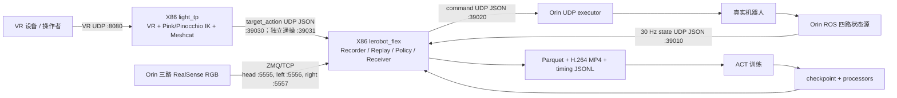

# JZ Robot Pin Timed 通信原理报告

更新日期：2026-07-17

适用仓库：`/home/luzhuang/cqy/aaa/flexible_lerobot`

适用系统：`my_devs/jz_robot_pin_timed`、`my_devs/my_var_tp/live_vr_replay_bridge`

## 1. 目的与术语

本文说明本项目的多设备通信机制、数据格式、图像编解码、时序证据和运行排他关系。文中将机器人侧
NVIDIA Orin 称为 **Orin 端**，将运行 LeRobot、录制、回放、训练和推理的工作站称为 **X86 端**。

系统的关键原则是：VR、相机、状态、模型、记录与真实机器人控制不是一条单一通道，而是多条具有
不同语义的链路。尤其不能把 VR 的 `target_action` 误认为已经发给机器人的 command。



## 2. 设备职责

| 角色 | 典型地址/路径 | Conda 环境 | 职责 |
|---|---|---|---|
| Orin 端 | `192.168.1.81`、`/home/data/test/workspace/flexible_lerobot` | `lerobot` | ROS 状态桥、三路相机发布、UDP command executor |
| X86 数采/推理端 | `/home/luzhuang/cqy/aaa/flexible_lerobot` | `lerobot_flex` | 录制、回放、数据检查、训练、策略推理、State/相机接收 |
| X86 VR/IK 端 | 同一机器的 `my_devs/my_var_tp` | `light_tp` | VR 输入、坐标映射、Pink IK、Meshcat、target action 发布 |
| 浏览器 | 例如 `10.1.42.3` 网络侧 | - | 打开 Meshcat 与数采 Web 页面 |
| 真实机器人 | 由 Orin 驱动 | - | 执行 Orin executor 接受的动作 |

`10.1.42.3` 是 X86 的办公网/浏览器访问示例地址；`192.168.1.81` 是 Orin 在机器人网络上的地址。
二者用途不同，不能互换。

## 3. 端口与方向总表

| 端口 | 协议 | 方向 | 发送者 -> 接收者 | 载荷语义 |
|---:|---|---|---|---|
| `8080` | UDP | VR -> X86 | VR 设备 -> VR/IK 进程 | 原始 VR pose、手柄等输入包 |
| `39010` | UDP | Orin -> X86 | State bridge -> JZRobotPinTimed | 当前 raw18 State 与可选 `source_timing` |
| `39020` | UDP | X86 -> Orin | Recorder/Replay/Policy -> executor | 实际 raw18 command，带 `dry_run` 或 `armed` 模式 |
| `39030` | UDP | X86 本机 | VR/IK -> recorder/control/replay receiver | 默认 `target_action`，表示操作者目标 |
| `39031` | UDP | X86 本机 | VR/IK -> standalone receiver | 独立遥操的专用 target-action 通道 |
| `5555` | ZMQ/TCP PUB/SUB | Orin -> X86 | head camera publisher -> subscriber | `camera_head` JPEG-over-JSON |
| `5556` | ZMQ/TCP PUB/SUB | Orin -> X86 | left camera publisher -> subscriber | `camera_left` JPEG-over-JSON |
| `5557` | ZMQ/TCP PUB/SUB | Orin -> X86 | right camera publisher -> subscriber | `camera_right` JPEG-over-JSON |
| `7000` | HTTP/TCP | 浏览器 <-> X86 | browser <-> Meshcat | 机器人模型、VR target 的可视化 |
| `8010` | HTTP/TCP | 浏览器 <-> X86 | browser <-> 数采 Web 后端 | 启停、日志、数据集选择与回放操作 |
| `8554` | RTSP/TCP | Orin -> X86 | 旧 RTSP camera bridge -> receiver | 兼容旧路径；第二阶段正式路径默认不用它 |

## 4. Orin 端如何通信

### 4.1 State：ROS 四源到 UDP `39010`

Orin 端从四个状态来源组合机器人状态：

```text
left_joints
right_joints
left_gripper
right_gripper
```

state bridge 将最新的四路数据组成一个约 30 Hz 的 state snapshot，使用 UTF-8 JSON 通过 UDP 发到
X86 的 `39010`。每个包至少具有：

```json
{
  "version": 1,
  "type": "state",
  "robot": "robot1",
  "seq": 45926,
  "stamp_ns": 123456789,
  "joints": {
    "left": {"left_joint1": 0.0},
    "right": {"right_joint1": 0.0}
  },
  "grippers": {
    "left": {"width": 0.0, "force": 80.0},
    "right": {"width": 0.0, "force": 80.0}
  },
  "source_timing": {}
}
```

`source_timing` 记录每个 ROS source 的 generation、接收时间和新鲜度。它用于证明“本次 State 是否由
四路最新来源组成”，而不是训练输入本身。X86 不把 timing 字段塞入 observation vector，而是保存进
每帧的 timing sidecar。

State 包编码与校验位于
[`src/lerobot/robots/jz_robot_udp/protocol.py`](../../../src/lerobot/robots/jz_robot_udp/protocol.py)。
编码前和解码后都会检查 JSON 结构、`version`、`type`、字段完整性、数值有限性与序号合法性。

### 4.2 三路视觉：RealSense 到 ZMQ `5555/5556/5557`

Orin 的三路 RealSense 对应：

| 相机 | 分辨率 | ZMQ 端口 |
|---|---:|---:|
| `camera_head` | `1280 x 720` | `5555` |
| `camera_left` | `640 x 480` | `5556` |
| `camera_right` | `640 x 480` | `5557` |

Orin 相机 publisher 的实际编码链路：

```text
RealSense RGB8 ndarray
  -> OpenCV RGB -> BGR
  -> cv2.imencode(".jpg", JPEG quality)
  -> JPEG bytes
  -> Base64 ASCII
  -> JSON string
  -> ZMQ PUB send_string()
```

发送的 JSON 顶层格式为：

```json
{
  "protocol": "jz_realsense_zmq",
  "protocol_version": 1,
  "timestamps": {"camera_head": 123.456},
  "images": {"camera_head": "<base64 JPEG>"},
  "camera_timing": {
    "camera_head": {
      "sequence": 123,
      "pixel_format": "RGB8",
      "encoding": "jpeg",
      "jpeg_quality": 95,
      "payload_bytes": 123456
    }
  }
}
```

`camera_timing` 还会记录抓帧、JPEG 编码、Base64、JSON 与队列相关时间。X86 不将 Orin monotonic
time 和 X86 monotonic time 直接相减，因为两台机器不是同一个时钟。

实现位置：

- [orin_realsense_zmq.py](../../../src/lerobot/robots/jz_robot_pin_timed/orin_realsense_zmq.py)
- [第二阶段开发报告](第二阶段开发报告.md)

### 4.3 Command：UDP `39020` 到 Orin executor

真正可驱动机器人的通道是 X86 -> Orin 的 `39020/UDP`。command 也是严格 UTF-8 JSON：

```json
{
  "version": 1,
  "type": "command",
  "robot": "robot1",
  "seq": 100,
  "stamp_ns": 123456789,
  "mode": "armed",
  "actions": {
    "left": {"left_joint1": 0.0},
    "right": {"right_joint1": 0.0},
    "grippers": {
      "left": {"width": 0.0, "force": 80.0},
      "right": {"width": 0.0, "force": 80.0}
    }
  }
}
```

`mode=dry_run` 表示软件演练模式；`mode=armed` 才允许进入已 armed 的 Orin executor。X86 的
`send()` 完成只代表本机 UDP socket 已接受这个包，不能证明 Orin 已收包、ROS 已 publish 或电机已执行。

## 5. X86 端如何通信

### 5.1 State 和相机进入 `JZRobotPinTimed`

X86 的 `JZRobotPinTimed` 同时维护：

```text
State cache
  - UDP :39010
  - 最新有效 State、revision、seq、receive wall/monotonic time

Camera cache
  - 三个 ZMQ SUB
  - 每路 frame 的 sequence、decode time、receive time、RGB image
```

一个 observation 的核心顺序为：

```text
1. 等待 State revision 相对于上一次 observation 推进。
2. 取得新 State 的本机 receive 时间。
3. 从每一路相机缓存中选择 receive time 最接近该 State 的 frame。
4. 生成 raw18 observation.state 与三路 RGB image。
5. 记录 state/camera 的 seq、age、skew、reuse 等 timing 元数据。
```

如果 State 没推进，程序会报 `Timed robot state did not advance`，而不是静默复用旧状态。相机/State
skew 是“X86 本机 State 接收时间”和“X86 本机相机接收/解码时间”的匹配约束，不是曝光时间，也不是
跨机器物理同步证明。

### 5.2 VR/IK 和 target action

VR 设备把原始输入发到 X86 `8080/UDP`。`light_tp` 内的 VR visual publisher 执行：

```text
VR UDP input
  -> 坐标系映射、相对参考点与平滑
  -> Pink/Pinocchio 双臂 IK
  -> 14 个关节目标 + 双夹爪 width/force
  -> target_action JSON
  -> UDP :39030 或 standalone :39031
```

`target_action` 的语义是“操作者/IK 想要到达的目标”，不是 Orin command。它含有：

```text
version, type=target_action, robot, seq, stamp_ns, actions
actions.left / actions.right：各 7 个关节位置
actions.grippers.left/right：width、force
```

实现位置：

- [vr_visual_publisher.py](../../my_var_tp/live_vr_replay_bridge/live_vr_replay_bridge/vr_visual_publisher.py)
- [live_vr_replay_bridge/protocol.py](../../my_var_tp/live_vr_replay_bridge/live_vr_replay_bridge/protocol.py)

### 5.3 录制模式

正式录制时的命令链如下：

```text
VR -> IK -> target_action :39030
                  +
Orin State :39010 -> Recorder
Orin camera :5555/:5556/:5557 -> Recorder
                  -> Recorder 生成实际 send_action()
                  -> command :39020 -> Orin executor
                  -> 保存数据集
```

Recorder 保存的是 `send_action()` 返回的实际发送 action，而不是未经边界处理的原始 VR 目标。这样
Parquet 中的 action 与实际交给底层发送层的 command 保持同一语义。

录制产物：

```text
data/*.parquet
  raw18 observation.state、raw18 action、episode/frame 索引

videos/*.mp4
  三路 H.264，常用 CRF 18

meta/timing/episode-*.jsonl
  state、camera、target_action、实际 command 的时序证据
```

### 5.4 回放模式

回放不需要 VR/IK。它从选择的数据集读取某个 episode 的 action，再通过同一类 Robot send path
产生 `39020` command：

```text
dataset action -> replay loop -> X86 Robot boundary -> UDP :39020 -> Orin executor
```

数据集路径不必位于 `tests/outputs`。Web 页面中的自动扫描目录仅用于下拉列表；只要给出绝对路径，且
目录具有 `meta/info.json`、`robot_type=jz_robot_pin_timed` 和已保存 episode，即可加载与回放。

### 5.5 模型推理模式

策略推理既不依赖 VR 也不依赖 `target_action`：

```text
State :39010 + 三路相机 ZMQ
  -> raw18 observation
  -> checkpoint preprocessor
  -> model16 state + 224x224 images
  -> ACT policy
  -> model16 action
  -> checkpoint postprocessor
  -> raw18 action（force 固定回填）
  -> X86 Robot boundary
  -> command :39020
```

`raw18` 为 14 个关节 + 双夹爪 width/force，共 18 维；模型内部 `model16` 删除两个 force，使用
14 个关节 + 双夹爪 opening。模型不能直接向 `39020` 写任意数组，必须先经过 checkpoint 中固化的
projection、normalization、unnormalization 和 expansion processor。

## 6. 图像解码与数据集视频编码是两件事

实时相机网络载荷与落盘训练视频不是同一种编码：

```text
实时网络：RGB8 -> JPEG -> Base64 -> JSON -> ZMQ/TCP
X86 接收：ZMQ -> JSON -> Base64 -> JPEG -> BGR -> RGB
数据集视频：RGB observation -> H.264 MP4（CRF 18）
```

因此，正式数据路径通常存在两次有损压缩：Orin 的 JPEG 与 X86 数据集视频的 H.264。降低 H.264
CRF 只能减少第二次编码损失，不能修复 RealSense、Orin JPEG、网络丢包或颜色/ISP 问题。

X86 ZMQ receiver 对每个消息验证：

- `protocol=jz_realsense_zmq` 且版本正确；
- 消息只包含期望的相机名称；
- Base64 可解码、JPEG payload 长度与 metadata 一致；
- `cv2.imdecode()` 成功；
- 解码后 image 为预期尺寸的 `uint8 RGB`；
- sequence 严格递增，并记录 sequence gap、队列延迟与解码耗时。

## 7. 排他关系：为什么不能同时启动所有程序

最重要的排他资源是 X86 的 `39010/UDP`。下列程序都要绑定这个 State 端口：

```text
Recorder
Replay
Policy inference
Timed probe
Timed teleop/control
live_vr_replay_bridge robot_replay_receiver
```

同一 UDP bind 不能由这些互不协调的消费者共享。因此：

```text
录制时：只运行 joystick/IK publisher + recorder。
推理时：停止 joystick、recorder、replay、probe、control，只运行 policy。
独立遥操时：即使 target action 改用 :39031，仍必须独占 :39010 和 command :39020。
```

`39031` 只解决独立遥操与录制在 target-action 通道上的冲突，不能解决 State 与 command 的控制权冲突。

## 8. Web 数采系统处于什么位置

Web 数采系统监听 `8010/TCP`，它不是机器人实时控制协议。它的角色是：

```text
浏览器表单
  -> Web 后端参数校验
  -> 生成 record/replay shell 命令
  -> 启动或停止后台 recorder/replay 进程
  -> 浏览器读取日志和状态
```

真正的实时链路仍然是 `39010`、`39020`、`39030/39031` 和 `5555-5557`。Web 页面如果启用 armed
操作，只是替用户启动已有的受限脚本，不会改变 State、command 或相机协议。

## 9. 常见故障的通信层定位

| 现象 | 优先检查 | 典型含义 |
|---|---|---|
| `Address already in use` on `39010` | `ss -lunp | grep ':39010'` | recorder/replay/probe/policy/control 仍有一个在占用 State socket |
| target action 首包超时 | `39030` 或 `39031`、VR publisher 日志 | VR/IK 未发包、发往错误端口或 publisher 未进入 publish 条件 |
| `Timed robot state did not advance` | Orin State publisher、UDP 丢包、X86 接收线程 | 新 State 的 `seq` 没有推进；不是相机单帧 skew 异常 |
| ZMQ 相机连接超时 | `5555-5557`、Orin publisher、网络链路 | 相机 PUB 未启动、端口错误、链路不可达或无有效首帧 |
| ZMQ frame 被拒绝 | ZMQ receiver 日志 | JSON/Base64/JPEG/schema/sequence/尺寸校验失败 |
| Meshcat 页面空白 | `7000`、VR visual publisher 日志 | 可视化发布进程或浏览器连接问题，不等于机器人 State/command 失效 |
| 训练视频发糊 | JPEG quality、H.264 CRF、源相机图像 | 需区分 Orin JPEG 源损失与 X86 H.264 二次编码损失 |

## 10. 通信边界结论

1. Orin 负责 State、相机和最终 command executor；X86 负责把这些输入组织为录制、回放或推理。
2. `target_action` 是 VR/IK 目标，`command` 才是通往真实机器人的命令。
3. State 与 command 使用严格 JSON/UDP；三路相机使用 JPEG/Base64/JSON 的 ZMQ/TCP PUB/SUB。
4. X86 使用本机 receive/decode 时间将 State 与相机帧配对，并以 JSONL 保存可审计的时序证据。
5. Pink/VR、Recorder、Replay、Policy 都共享底层 State 与 command 资源，必须按运行模式互斥。
6. 训练和推理都保持 raw18 wire/data 边界；ACT 模型内部采用 model16，靠 checkpoint processor 完成双向映射。

## 11. 相关文件

- [第一数采开发系统](第一数采开发系统.md)
- [第二阶段开发报告](第二阶段开发报告.md)
- [数采 Web 系统 README](../web_collection_system/README.md)
- [实时 VR bridge README](../../my_var_tp/live_vr_replay_bridge/README.md)
- [UDP 协议实现](../../../src/lerobot/robots/jz_robot_udp/protocol.py)
- [ZMQ 相机接收实现](../../../src/lerobot/robots/jz_robot_pin_timed/timestamped_zmq_camera.py)
