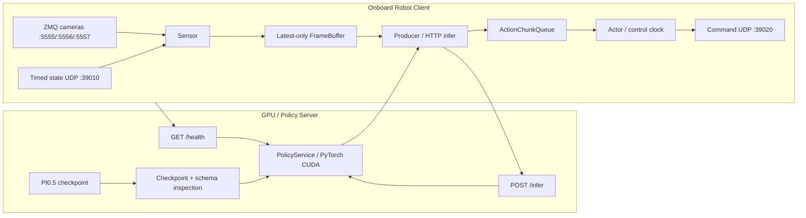
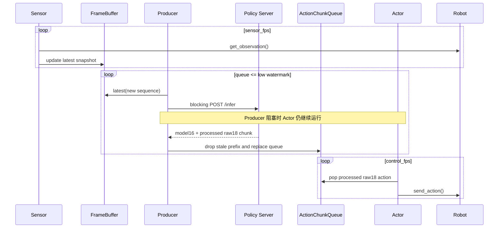

# JZ Robot Pin Timed PI0.5 推理模块设计与验证报告

报告日期：2026-07-20  
代码目录：`my_devs/jz_robot_pin_timed/pi05/rtc_infer`  
运行环境：`/home/luzhuang/miniconda3/envs/lerobot_flex/bin/python`

## 1. 报告结论

本模块实现了一个面向 `jz_robot_pin_timed` 的分布式 PI0.5 推理链路：GPU 侧加载策略模型并提供
HTTP 推理服务，上机侧读取 timed state 和三路 ZMQ 相机，构造训练一致的 observation，请求动作
chunk，再按照所选运行模式向机器人 command UDP 发送动作。

当前实现支持三种客户端运行模式：

| 客户端模式 | 客户端执行方式 | 在线协议 mode | RTC guidance | 动作使用方式 |
| --- | --- | --- | --- | --- |
| `single_step` | 严格串行 | `single_step` | 否 | 每个请求最多发送一条未过期动作 |
| `async_single_step` | Sensor/Producer/Actor 三线程 | `single_step` | 否 | 异步消费普通 PI0.5 action chunk |
| `rtc` | Sensor/Producer/Actor 三线程 | `rtc` | 是 | 异步队列，并向模型传 delay、leftover 和 horizon |

这里必须区分两个概念：

- `async_single_step` 是客户端调度异步，不是新的服务端协议。服务端仍收到 `single_step`。
- `rtc` 才会启用 PI0.5 的 RTC processor，并传递 `inference_delay`、`prev_chunk_left_over` 和
  `execution_horizon`。

服务端没有 TensorRT 后端，当前使用 PyTorch/CUDA。HTTP server 可以接收并发连接，但
`PolicyService` 用模型锁串行执行 GPU 推理；客户端 Producer 也只维持一个在途 HTTP 请求。
异步带来的主要收益是：模型推理阻塞时，Actor 仍可以按控制频率消费已经得到的动作队列。

## 2. 目标与非目标

### 2.1 设计目标

1. 复用训练完成的 PI0.5 checkpoint 和 checkpoint 内序列化的 processor。
2. 保持现场 raw18 数据边界，同时让模型内部只处理 model16。
3. 同时提供保守的串行单步、普通 chunk 异步执行和完整 RTC 三种模式。
4. 允许显式设置 sensor FPS、control FPS 和运行时间。
5. 在连接机器人前完成服务端协议、相机、schema 和 checkpoint 身份握手。
6. 把真实动作发送放在多层显式确认之后，并对异常状态采用 fail-closed 行为。
7. 为指定训练 run 提供固定 launcher，避免服务端和客户端选择了不同权重。

### 2.2 非目标

本模块不负责：

- 启动或停止 Orin state、camera、command 服务；
- 自动 reset、回零、轨迹编排或恢复机器人姿态；
- 替代现场物理急停；
- 将内部 pickle-over-HTTP 协议暴露到公网；
- 在当前版本中提供 TensorRT、多请求并行 GPU 推理或 30 Hz 上机控制；
- 自动判断模型语义是否符合现场任务，语义验收仍需要现场人员观察。

## 3. 模块组成

| 文件 | 责任 |
| --- | --- |
| `run_policy_server.py` | 参数解析、checkpoint 检查、模型加载、health 输出和 HTTP server 生命周期 |
| `run_robot_client.py` | health 握手、机器人构造、三种 runtime 分派、summary 输出 |
| `jz_pi05_runtime/checkpoint.py` | checkpoint、processor、schema、step 和 fingerprint 检查 |
| `jz_pi05_runtime/protocol.py` | 请求/响应数据结构、协议版本、受限反序列化和 shape 约束 |
| `jz_pi05_runtime/http_server.py` | `/health`、`/infer`、Bearer 鉴权和 body 大小限制 |
| `jz_pi05_runtime/remote_client.py` | 阻塞式 HTTP health/infer client 和响应一致性检查 |
| `jz_pi05_runtime/policy_service.py` | 模型锁、预处理、PI0.5 chunk 推理、RTC mode 切换和后处理 |
| `jz_pi05_runtime/client_runtime.py` | 串行闭环及 Sensor/Producer/Actor 异步 runtime |
| `jz_pi05_runtime/action_queue.py` | model16 leftover/raw18 action 双队列、过期丢弃和空队列策略 |
| `jz_pi05_runtime/robot_builder.py` | timed state、三路相机、UDP command 和 live feature contract |
| `jz_pi05_runtime/robot_io.py` | 对同一 Robot 实例的 observation/action 访问串行化 |
| `jz_pi05_runtime/safety.py` | execution/transport 配对、armed 确认和 raw18 动作契约检查 |
| `run_server.sh`、`run_client.sh` | Conda、缓存、日志、参数和命令打印的统一入口 |
| `run_onboard_*` | 固定权重 profile 和真实上机入口 |

## 4. 总体架构



默认现场地址为：

- Orin：`192.168.1.81`
- state bind：`0.0.0.0:39010`
- command target：`192.168.1.81:39020`
- head camera：ZMQ `5555`，`1280x720`
- left camera：ZMQ `5556`，`640x480`
- right camera：ZMQ `5557`，`640x480`
- 固定任务文本：`jz robot pin timed vr teleoperation`

相机配置为 30 FPS，但 onboard Sensor/Control launcher 当前只允许 `1..20` FPS。也就是说相机可以
以 30 FPS 供帧，客户端按照 `ONBOARD_SENSOR_FPS` 从最新可用帧中采样；当前推荐运行点是训练一致的
20 FPS，而不是让控制循环直接跑到 30 FPS。

## 5. 数据与协议边界

### 5.1 raw18、model16 和 processed raw18

现场 Robot 和 dataset feature 使用 raw18：14 个关节/控制量加两侧夹爪 opening/force。checkpoint
preprocessor 将 observation state 从 raw18 投影为 model16；PI0.5 输出 model16 action；checkpoint
postprocessor 完成反归一化并展开回 raw18，同时把两侧 force 槽写为 `80.0`。

一次推理响应同时保留：

- `raw_actions: (T, 16)`：模型空间动作，只供 RTC leftover/guidance 使用；
- `processed_actions: (T, 18)`：现场执行空间动作，只供 Actor 构造 Robot action 使用。

二者时间长度必须相同，时间长度限制为 `1..50`，所有值必须有限。把 model16 和 raw18 分开保存，
避免了把已反归一化的机器人动作错误地回传给 RTC processor。

### 5.2 请求字段

`InferenceRequest` 包含：

- `request_id`
- `mode`，在线协议只允许 `single_step` 或 `rtc`
- `observation_frame`
- `task`
- `robot_type`
- `obs_sequence_id`
- `predicted_delay_steps`
- `prev_chunk_left_over`
- `execution_horizon`

协议明确禁止 `single_step` 请求携带 leftover。RTC leftover 必须是有限的 `(T,16)` 数组。

### 5.3 HTTP 边界

服务端提供两个端点：

- `GET /health`：返回协议、模型、相机、schema、checkpoint 和 RTC 配置；
- `POST /infer`：接收一个序列化的 `InferenceRequest`，返回 `InferenceResponse`。

鉴权发生在读取和反序列化 body 之前。请求和响应默认限制为 64 MiB。pickle 使用显式协议 envelope
和受限 unpickler，但仍定位为可信 Python 内网协议，不应作为公网 API。

## 6. 服务端推理流程

服务端启动按以下顺序执行：

1. 解析 policy、tokenizer、device、RTC 和鉴权配置。
2. 检查 checkpoint 必需文件、policy type、输入输出 feature、相机键和分辨率。
3. 加载并核对 JZ training schema，确认 raw18/model16 语义。
4. 检查 `train_config.steps`、checkpoint 数字目录和 complete-step 要求。
5. 计算 checkpoint fingerprint。
6. 加载 PI0.5 policy、preprocessor 和 postprocessor 到 CUDA。
7. 建立 `PolicyService`，安装 PI0.5 RTC processor。
8. `CHECK_POLICY_LOAD=true` 时输出 health 后退出；正常模式才监听 HTTP。

每个 `/infer` 请求进入 `PolicyService.infer()` 后，会在同一个 `threading.Lock` 内完成：

```text
observation_frame
  -> prepare_observation_for_inference
  -> checkpoint preprocessor
  -> policy.predict_action_chunk
  -> checkpoint postprocessor
  -> model16/raw18 boundary validation
  -> CPU NumPy InferenceResponse
```

当 wire mode 为 `rtc` 时，调用 `predict_action_chunk` 额外传入：

```text
inference_delay       = predicted_delay_steps
prev_chunk_left_over  = 尚未执行的 model16 动作
execution_horizon     = 默认 10
```

并在调用期间临时启用 policy/model 的 RTC mode。`single_step` 不传这些参数，并明确关闭 RTC mode。

## 7. 三种客户端运行模式

### 7.1 `single_step`：严格串行基线

单次循环顺序如下：

```text
读取 observation
  -> 构造 single_step request
  -> 阻塞等待模型
  -> 按 observation age 计算过期步数
  -> 选择第一条未过期动作
  -> 构造并检查 raw18 Robot action
  -> 最多发送一条动作
  -> 进入下一次循环
```

该模式没有动作队列，也不会让动作执行与下一次模型推理并行。它的价值是语义最简单，适合作为新
checkpoint 的第一层真实上机验收。

### 7.2 `async_single_step`：普通 chunk 的异步执行

该模式复用三线程 runtime，但 Producer 强制构造：

```text
wire mode             = single_step
predicted_delay_steps = 0
prev_chunk_left_over  = None
```

服务端因此生成普通 PI0.5 action chunk，不启用 RTC guidance。客户端收到 chunk 后仍按照真实响应延迟
丢弃 stale prefix，把剩余 processed raw18 动作放入队列，由 Actor 按 control FPS 消费。

它解决的是“推理时 Actor 不能继续执行已有动作”的调度问题，但没有解决新旧 chunk 在模型内部的
一致性问题。新响应到达时，客户端以新 chunk 替换当前队列，不会把旧 leftover 交给模型做 RTC 引导。

### 7.3 `rtc`：完整 Real-Time Chunking

RTC 使用相同三线程结构，但 Producer 会：

1. 从最近请求延迟记录计算 p95。
2. 使用 `ceil(p95_latency / control_dt)` 得到 `predicted_delay_steps`。
3. 从队列取尚未执行的 model16 `prev_chunk_left_over`。
4. 将 delay、leftover 和 execution horizon 发给服务端。
5. 服务端在 PI0.5 denoising 中启用 RTC guidance。
6. 响应返回后再次按 observation age 丢弃真实 stale prefix，并替换动作队列。

因此 RTC 同时处理两类时间问题：

- 模型生成阶段：用预测 delay 和旧 chunk leftover 做 guidance；
- 客户端执行阶段：用真实 observation-to-response age 丢弃已经过期的动作。

## 8. 异步三线程实现



线程责任：

- `JZPI05Sensor`：按 sensor FPS 读取 observation，更新 latest-only `FrameBuffer`。
- `JZPI05Producer`：根据 queue low watermark 决定何时请求，任一时刻只有一个 HTTP infer 在途。
- `JZPI05Actor`：按 control FPS 消费 processed raw18 动作。

`FrameBuffer` 只保存最新 observation，并使用递增 sequence ID，避免 Producer 重复请求同一帧。
`SerializedRobotIO` 用 `RLock` 串行化 Sensor 和 Actor 对同一 Robot 实例的调用。

`ActionChunkQueue` 自身也使用 `RLock`。合并新 chunk 时执行：

```text
drop_steps = ceil((response_ready_time - observation_time) / control_dt)
queue = new_chunk[drop_steps : drop_steps + max_queue_size]
```

默认空队列策略是 `stop`；还实现了 `skip_send` 和 `hold_last_action`，但真实 onboard wrapper 固定为
`stop`。连续完全 stale chunk 达到阈值时 runtime 停止并返回非零错误。

## 9. Checkpoint profile 与身份锁定

当前 onboard launcher 固定支持以下 profile：

| Profile | Checkpoint | checkpoint step | configured steps | complete |
| --- | --- | ---: | ---: | --- |
| curated final | `.../checkpoints/015705/pretrained_model` | 15705 | 15705 | true |
| curated intermediate | `.../checkpoints/010470/pretrained_model` | 10470 | 15705 | false |
| all 170 | `outputs/pi05_output/...all_170.../checkpoints/047320/pretrained_model` | 47320 | 70980 | false |
| all 200 | `outputs/pi05_output/...all_200.../checkpoints/007320/pretrained_model` | 7320 | 21960 | false |

两个新 profile 都不是各自 `train_config.steps` 的 final step，因此不会伪装成 complete checkpoint。
它们通过各自独立确认变量显式放行，并固定 `REQUIRE_COMPLETE_STEP=false`。服务端 launcher 不接受
`last` 代替数字目录。

服务端启动前精确检查：

- checkpoint 绝对路径；
- `training_state.step`；
- `train_config.steps`；
- schema fingerprint；
- checkpoint fingerprint。

profile fingerprint 由 schema fingerprint、`config.json`、pre/postprocessor JSON、
`train_config.json`、权重文件名、权重大小和权重前 1 MiB 共同生成。

客户端在连接 Robot 之前调用 `/health`，并再次核对：

- protocol version；
- `policy_type=pi05`；
- model state/action 为 16，wire action 为 18；
- schema ID/version；
- 三路 camera keys 和精确 shape；
- 服务端支持所需 wire mode；
- checkpoint path、step、configured steps、complete 和 fingerprint。

因此 170 客户端连接 200 服务端，或反向连接，都会在 Robot connection 之前失败。

## 10. 安全与失败处理

### 10.1 执行模式

- `dry_run` 固定使用 local transport。
- `armed` 固定使用 UDP transport。
- execution 和 transport 不匹配时直接拒绝。

真实动作发送要求三个变量同时为 `1`：

```text
JZ_ROBOT_PIN_ARMED
I_UNDERSTAND_JZ_ROBOT_PIN_MOVES_ROBOT
JZ_POLICY_INFERENCE_ARMED
```

异步模式还要求 `JZ_PI05_SINGLE_STEP_ARMED_PASSED=1`，用于确认现场已经完成单步验收。

### 10.2 动作契约

每条待执行动作必须满足：

- shape 精确为 raw18；
- 值全部有限；
- key 集合和顺序符合 `jz_pin_raw18_v1`；
- 左右 force 槽分别位于索引 15 和 17，值为 `80.0`。

Robot 配置继续检查 state sender IP、state freshness、state sequence advance、相机/state 时间偏差、
robot ID、gripper 范围和 armed transport。

当前上机入口支持显式关闭 initial/per-step joint delta checks，但必须同时设置：

```text
JZ_PI05_DISABLE_JOINT_DELTA_CHECKS=1
I_UNDERSTAND_JOINT_DELTA_CHECKS_ARE_DISABLED=1
```

该设置不会关闭 raw18 shape、finite、force、state freshness、sender、sequence、armed 或 health 检查。
报告不把现场人员手持急停视为软件保证；物理急停是模块之外的最后防线。

### 10.3 网络边界

localhost server 可以不配置 token。只要 server bind 或 client URL 不是 loopback，就必须使用 Bearer
token。URL 必须是裸 `http://host:port`，禁止把凭据写在 URL 中，也禁止额外 path/query。

### 10.4 停止条件

下列情况会停止 runtime 或拒绝启动：

- 首个 action chunk 超时；
- 连续完全 stale chunk 超过限制；
- 默认策略下 action queue 为空；
- server request/response ID 或 mode 不一致；
- health/checkpoint/schema/camera contract 不一致；
- state、camera 或 RobotIO 抛出异常；
- 达到 `run_time_s`；
- `Ctrl+C`。

## 11. 关键运行参数

| 参数 | 当前 onboard 范围/默认 | 说明 |
| --- | --- | --- |
| `ONBOARD_SENSOR_FPS` | `1..20`，异步默认 20 | observation 采样频率 |
| `ONBOARD_CONTROL_FPS` | `1..20`，异步默认 20 | Actor 动作发送节拍 |
| `ONBOARD_RUN_TIME_S` | `1..300` | 单次运行时长 |
| `QUEUE_LOW_WATERMARK` | 30 | 队列低于该水位时 Producer 请求新 chunk |
| `MAX_QUEUE_SIZE` | 50 | 客户端最多保留的动作步数 |
| `FIRST_CHUNK_TIMEOUT_S` | 60 | 首个 chunk 等待时间 |
| `RTC_EXECUTION_HORIZON` | 10 | RTC execution horizon |
| `REQUEST_TIMEOUT_S` | 120 | 单次 HTTP infer 超时 |
| `FULLY_STALE_CHUNK_LIMIT` | 3 | 连续全 stale 的停止阈值 |
| `EMPTY_QUEUE_STRATEGY` | onboard 固定 `stop` | 队列耗尽行为 |

提高 control FPS 不会提高 GPU 推理吞吐，只会提高队列消费速度。能否稳定维持目标控制频率取决于：

```text
有效 chunk 长度 / control_fps > 新 chunk 的端到端生成时间
```

若推理延迟大于队列可覆盖时间，默认 `stop` 策略会因为队列耗尽而停止。RTC 可以改善 chunk 之间的
时间一致性，但不会让模型计算本身变快。

## 12. 验证结果

本次实现完成了以下无机器人验证：

1. `rtc_infer` 测试：`109 passed`。
2. 其余 JZ Robot、安全、training schema 和 timed state 测试：`242 passed, 1 skipped`。
3. Ruff format/check：通过。
4. 所有 `rtc_infer/*.sh` 的 `bash -n`：通过。
5. `pip check`：无损坏依赖。
6. `git diff --check`：通过。
7. all-170 checkpoint 在 CUDA 上完成 `CHECK_POLICY_LOAD`。
8. all-200 checkpoint 在 CUDA 上完成 `CHECK_POLICY_LOAD`。

CUDA load 检查结果：

| Profile | Fingerprint | Health step | 结果 |
| --- | --- | --- | --- |
| all 170 / 047320 | `aab77fc595dab01c12afdc681e9fb96627b01c32f69698bf2b5d891694bd6d0d` | `47320/70980` | PASS |
| all 200 / 007320 | `2e12eb2c67f6a11875aac24018d50c2cbcd6e52a962c82f346be1b698a63748c` | `7320/21960` | PASS |

两个权重加载时都报告一个共享 embedding key missing 提示：

```text
model.paligemma_with_expert.paligemma.model.language_model.embed_tokens.weight
```

加载器仍成功完成 state dict 加载、构建 policy health，并以 `CHECK_POLICY_LOAD passed` 正常退出。

另有一个独立摄像头测试在当前工作区无法收集，因为缺少 `my_devs.orin_session`。该问题与本次推理
模块修改无关，但意味着这一个可选摄像头集成测试没有纳入上述通过数。

上述测试没有启动 armed client、没有向 command UDP 发送动作。真实轨迹语义和物理动作仍以现场
验收为准。

## 13. 与 `src/lerobot/async_inference` 的关系

LeRobot 通用 `src/lerobot/async_inference` 提供 gRPC action chunk 框架，适合通用 Robot/Policy
异步传输。但当前 JZ PI0.5 模块没有直接迁移到该框架，原因是通用路径目前：

- 调用 `predict_action_chunk(observation)`，不传 PI0.5 RTC 的 delay、leftover 和 horizon；
- 不维护跨请求的 model16 `prev_chunk_left_over`；
- 没有本模块的 raw18/model16 双边界；
- 没有 JZ timed state、三路固定相机、force=80 和 checkpoint profile health 契约；
- 没有本模块的 armed/delta 双确认入口。

因此，“通用 async inference”与“本模块 RTC”不是可以直接互换的实现。未来若迁移，应先在 gRPC
协议中补齐 RTC temporal fields、JZ schema 和 health contract，并增加 PI0.5 RTC 集成测试。

## 14. 当前限制与后续工作

1. 服务端是 PyTorch，不是 TensorRT；RTC 是时间一致性技术，不是模型加速技术。
2. `RemotePolicyClient.infer()` 是阻塞 HTTP；仅 Actor 与推理并行，没有多请求 pipeline。
3. `PolicyService` 用全局模型锁，单服务实例不会并行执行多个 GPU inference。
4. onboard FPS 被限制在 20；相机 30 FPS 不等于控制 30 Hz。
5. `async_single_step` 没有 RTC guidance，新 chunk 直接替换队列。
6. 默认 `EMPTY_QUEUE_STRATEGY=stop`，模型偶发长尾延迟可能导致停止。
7. all-170/047320 和 all-200/007320 都不是各自训练计划的 final step。
8. 内部 HTTP payload 使用受限 pickle，只适用于可信网络。
9. 模块不控制现场急停，也不会自动 reset 机器人。
10. 当前验证覆盖模型加载和软件行为，但没有由本报告执行真实机器人动作测试。

建议后续按优先级进行：

1. 记录真实运行的 request p50/p95/p99、queue depth、drop steps 和 empty events。
2. 根据真实延迟决定 queue watermark，而不是只依赖固定 30。
3. 增加服务端 CUDA inference smoke，记录不同 checkpoint 的首帧和稳态延迟。
4. 补齐缺失的 `my_devs.orin_session` 测试依赖或将其改为明确的可选 skip。
5. 若要超过 20 Hz，先验证训练时间基准、Robot command executor 和 state/camera 同步能力。
6. 若迁移通用 gRPC async framework，先实现 RTC/JZ contract parity，再做替换。

## 15. 推荐验收顺序

每个新 checkpoint 应独立执行以下流程：

1. `PRINT_COMMAND_ONLY=true`：确认最终 policy path、mode、FPS、端口和运行时间。
2. `CHECK_POLICY_LOAD=true`：确认 checkpoint、processor 和 CUDA load。
3. `HEALTH_ONLY=true`：从客户端机器检查鉴权和 checkpoint health。
4. inference smoke：读取真实 state/camera 并推理，但不调用 `send_action`。
5. `single_step`：以低 FPS、短时间做首次动作方向检查。
6. `async_single_step`：确认普通 chunk 异步执行和队列行为。
7. `rtc`：恢复训练一致的 20 FPS，观察 p95 latency、drop steps 和 queue depth。

不能因为旧 checkpoint 已通过单步，就自动认为新 checkpoint 的动作语义已经验收。profile health
能证明“加载的是正确文件”，不能证明“模型输出在当前现场一定正确”。

## 16. 总结

本模块的核心不是单独增加一个网络 server，而是把四个边界同时固定下来：

1. checkpoint/processor/schema 的训练边界；
2. raw18/model16/raw18 的数据边界；
3. single-step、异步队列和 RTC guidance 的时间边界；
4. health、armed、state 和 action contract 的执行边界。

在当前实现中，`single_step` 提供最容易解释的保守基线，`async_single_step` 提供不启用 RTC 的
并发调度基线，`rtc` 在此基础上加入 PI0.5 的跨 chunk 时间引导。三个模式共用同一个 PyTorch
policy server，但客户端调度和 wire request 语义不同，不能只看脚本名称判断是否启用了 RTC。
